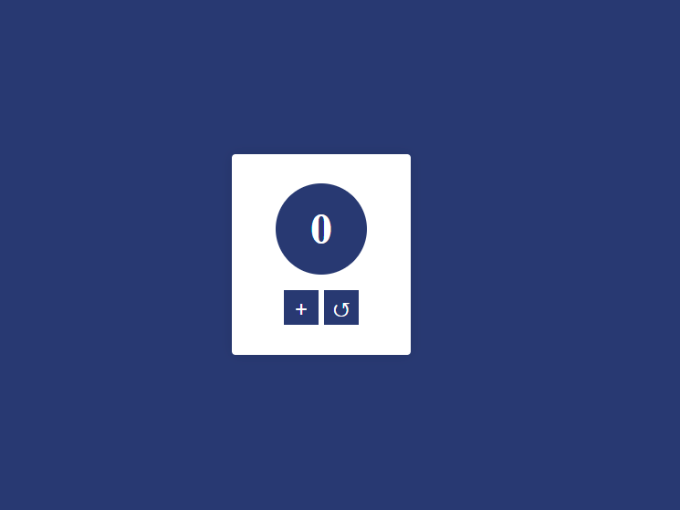

# Simple Tasbhi Application with Voice

This is simple tasbhi application for muslims. If you are muslims please use it for counting tasbhi when you get time of your hand and if your developer and you want to contribute something in this project please feel free to contribute it and make it very high quality and make this ui attractive. Thanks

## Using Technologies
- HTML5/HTML
- CSS3/CSS
- Vanilla JavaScript.
- Audio
- VS Code Editor
- Git bash/Github
- Poppins Fonts

and many more 

### If you wanna get a live link please go to this project about and grab that.

# Demo screenshot for Projects

> Thanks for reach out me on github